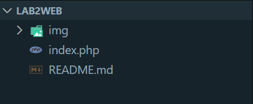
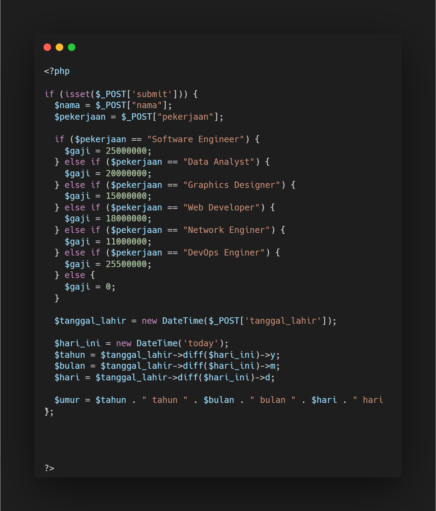
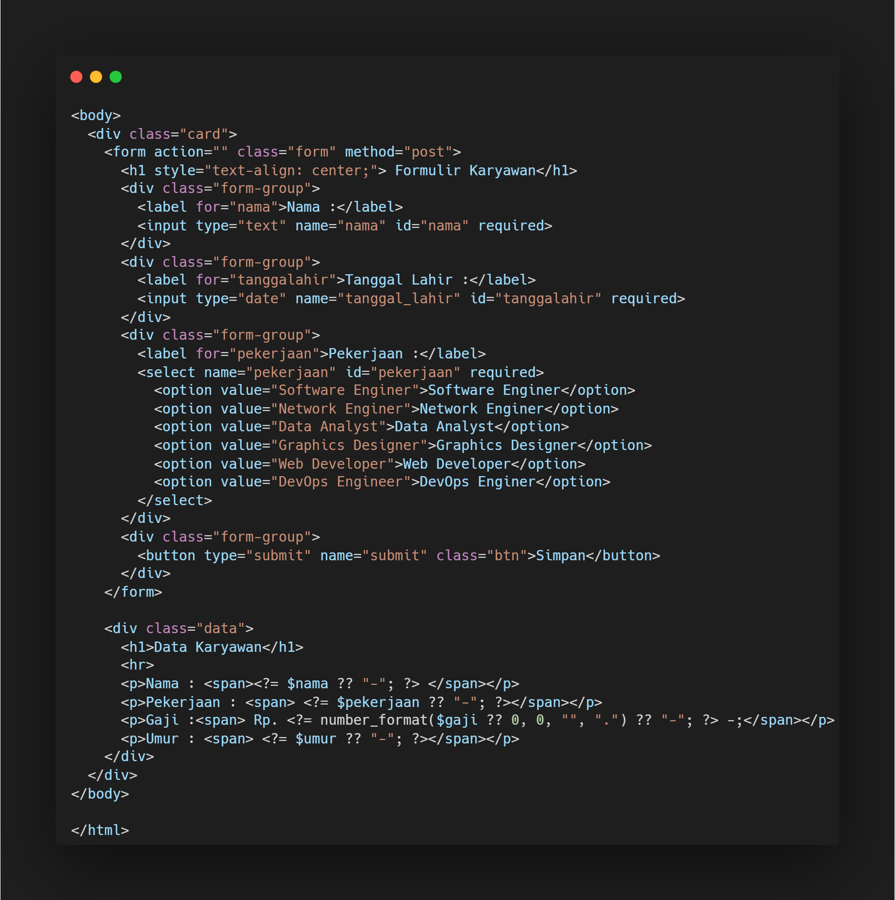
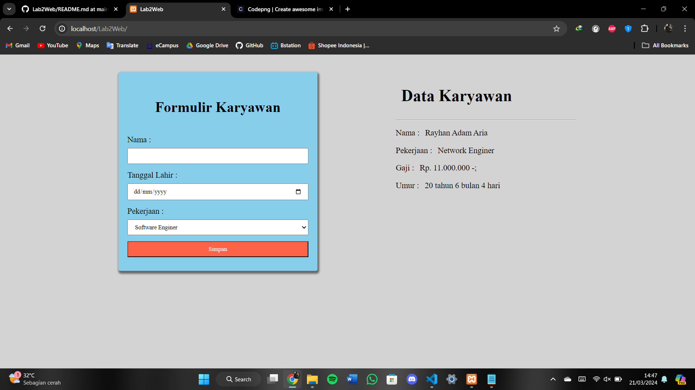

### Program sederhana input data karyawan menggunakan php

kali ini kita akan membuat sebuah porgram sederhana yaitu input data karyawan menggunakan bahasa pemrogramman PHP

> Tools yang dibutuhkan.
- XAMPP
- Visual Studio Code
- Browser (google chrome)

Pertama buat lah folder di dalam htdocs dengan nama **Lab2Web** lalu buat file bernama **index.php**
untuk penamaan folder dan file kalian bebas menamakannya.
Setelah itu buka folder tersebut dengan Visual Studio Code seperti gambar dibawah ini



selanjutnya buka file **index.php** lalu ikuti kode seperti gambar dibawah :


> Pembahasan
Pada kode diatas merupakan kode php dalam menangani formulir yang akan diinput,

`
if (isset($_POST['submit'])) {
`
ini pengecekan jika ada  post submit yang dikirim maka lakukan perintah berikut, jika tidak ada dia keluar blok kurang kurawal buka / tutup

Pada bagian berikut dilakukan pengecekan mengenai pekerjaan, jika pekerjaannya sebagai  **Web Developer** maka gaji nya 14000000 dan seterusnya tergantung pada yang diinputkan nanti didalam formulir

```
$pekerjaan = $_POST["pekerjaan"];
  if ($pekerjaan == "Software Engineer") {
    $gaji = 20000000;
  } else if ($pekerjaan == "Data Analyst") {
    $gaji = 18000000;
  } else if ($pekerjaan == "Graphics Designer") {
    $gaji = 15000000;
  } else if ($pekerjaan == "Web developer") {
    $gaji = 14000000;
  } else if ($pekerjaan == "Network Enginer") {
    $gaji = 10000000;
  } else if ($pekerjaan == "DevOps Engineer") {
    $gaji = 25500000;
  } else {
    $gaji = 0;
  }
```

Selanjutnya pada bagian blok kode berikut merupakan perhitungan umur berdasarkan tanggal lahir yang diinputkan, kita menggunakan fungsi bawaan php yaitu `DateTime()` yang mana nanti kita dapat mengetahui umur yang akan diinputkan berdasarkan tanggal lahirnya. lalu kita simpan di variabel umur.

```
$tanggal_lahir = new DateTime($_POST['tanggal_lahir']);

  $hari_ini = new DateTime('today');
  $tahun = $tanggal_lahir->diff($hari_ini)->y;
  $bulan = $tanggal_lahir->diff($hari_ini)->m;
  $hari = $tanggal_lahir->diff($hari_ini)->d;

  $umur = $tahun . " tahun " . $bulan . " bulan " . $hari . " hari ";

```

lanjut ke kode berikut :

kode berikut merupakan kerangka html yang akan menampilkan formulir dan data yang diinputkan, pada kode ini kita menambahkan style css agar terlihat menarik.


Selanjutnya tambahkan kode berikut :

pada kode dibawah ini merupakan tag formulir html. sebagai formulir dan hasil dari inputan yang akan diinputkan nanti.



setelah selesai saatnya kita jalankan programnya dengan cara buka xampp control panel lalu start apache, jika sudah buka browser lalu ketikan **`localhost/Lab2Web`**


Berikut hasil program yang akan muncul sebelum diinput dan sesudah diinput :




Selesai terima kasih semoga bermanfaat.
